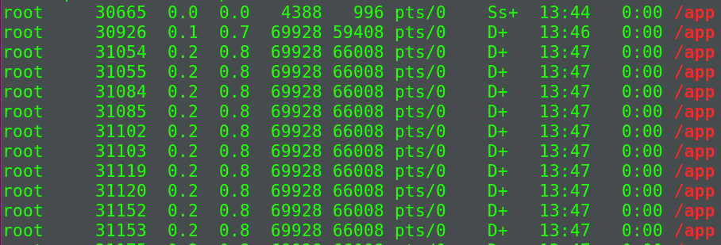
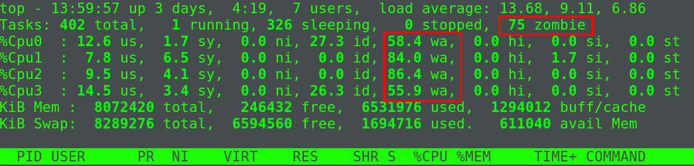
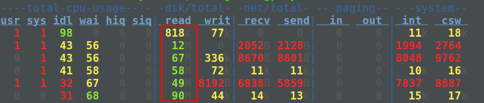
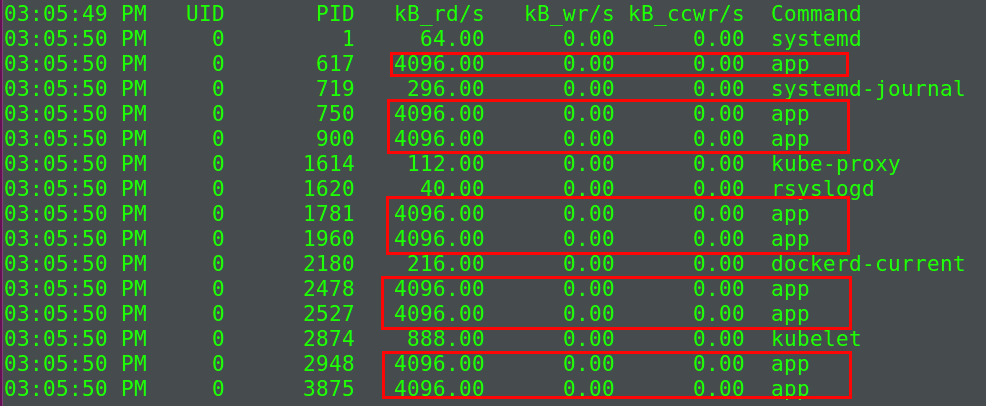
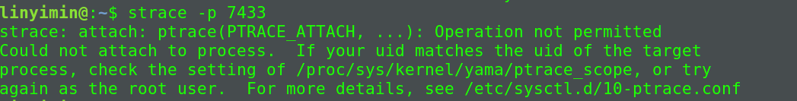
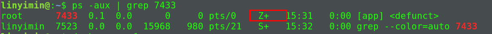
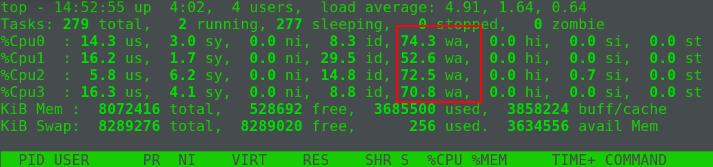
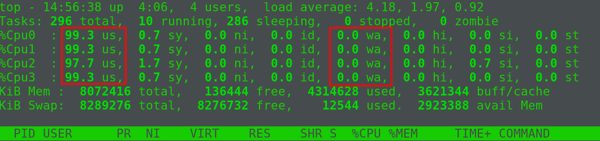

> 破山中贼易,破心中贼难


## 进程状态

- R(Running or Runable): 进程在就绪队列中,正在运行或者正在等待CPU资源运行
- D(Disk Sleep): 不可中断状态睡眠(Uninterruptible Sleep),表示进程正在和硬件交互,且交互过程不允许被其他进程或者中断打断
- Z(ZOmbie): 僵尸进程,进程实际上已经结束, 但是父进程没有回收它的资源(如进程描述符, PID等)
- S(Interruptible Sleep): 可中断睡眠状态,表示进程因为某个事件而被系统挂起.
- I(Idle): 空闲状态
- T(Stooped, Traced): 暂停或者跟踪状态


## 僵尸进程

正常情况下,当一个进程创建了子进程之后, 应该通过系统调用`wait`或者`waitpid`等待子进程结束然后回收子进程的资源.子进程在结束后,会产生`SIGCHLD`信号,所以父进程也可以通过向内核注册SIGCHLD`信号的处理函数,异步回收资源.一般来说,僵尸进程持续的时间都比较短,在父进程回收了它的资源后就会消亡,或者在父进程退出后,有`init`进程回收后也会消亡.

而一旦父进程没有处理子进程的终止,还一直保持运行状态,那么子进程会一直处于`僵尸状态`.<font color="#dd0000">大量的僵尸进程会耗尽PID进程号,导致不能创建新的进程.</font>

## 其他相关概念

### 进程组

表示一组相互关联的进程,例如每个子进程都会父进程所在组的成员.在后台运行的命令会构成`后台进程组`, 在前台运行的命令构成`前台进程组`.

### 会话

共享同一个控制终端的一个或多个进程组.当我们通过`ssh`登录服务器,就会打开一个控制终端`tty`,这个控制终端就会对应一个会话.

## 案例分析

启动相关docker容器

```shell
$ docker run --privileged --name=app -itd feisky/app:iowait
```

然后使用`ps -aux`查看相关进程信息

```shell
$ ps -aux | grep /app
```



根据`ps`命令的结果,我们可以知道多个`app`进程已经成功启动

- `+`: 前台进程组
- `s`: 会话的领导进程

接着使用`top`查看系统的使用资源:

```shell
top
```



根据`top`命令的结果,我们可以发现存在三个问题:

1. 平均负载性对较高(4个逻辑CPU)
2. `iowait`太高(这也是引起平均负载升高的一大原因)
3. 僵尸进城在不断增多,说明父进程没有正确清理子进程的相关资源

### iowait分析

很明显,iowait升高,首要应该去查询系统的IO情况.

我们使用`dstat`查看系统的IO情况

```shell
$ sudo dstat 1 5 # 间隔1秒输出5组数据
```



可以发现磁盘的读请求很大,说明`iowait`的升高与读请求相关,也就是磁盘读导致的.

接着可以使用`pidstat`命令查看所有进程的IO情况

```shell
$ pidstat -d 1 20 # 间隔1秒输出20组数据
```



可以发现大量的`app`进程在进行磁盘读操作,每秒读速率为4MB.这里还可以验证一点:<font color="#dd0000">由于进行磁盘IO的进程会处于`不可中断状态(D)`, 内核对硬件的一种保护机制, 避免出现数据的不一致.</font>

根据上述`pidstat`命令得到的结果,使用`app`进程对应的`PID`, 在`ps`命令中查找, 会发现其对应的状态是`D`, 也就是处于`不可中断状态`.


现在基本上可以确定是进程`app`的问题,那`app`进程到底在进行什么IO操作呢?由于进程想要访问磁盘,必须要使用`系统调用`陷入内核态, 在内核态完成IO操作.所以接下来我们要找出进程的`系统调用`.我们使用`strace`命令来查找相关的系统调用.`strace`是最常用的跟踪系统调用的命令工具.

在终端运行`strace -p PID`:

```shell
$ strace -p 7433
```



可以发现`starce`命令执行失败了, 而且错误居然是没有权限,而我们一直用的是`root`账户.这种情况下,我们<font color="#dd0000">一般需要检查一下进程的状态是否正常</font>

```shell
$ ps -aux | grep 7433
```



可以发现, PID为7433的进程已经变为`僵尸进程`,而僵尸进程是已经执行完退出的进程,所以无法使用`strace`命令进行跟踪分析.根据以上的分析我们可以发现传统的`ps`, `dstat`, `pidstat`, `strace`, `top`这些工具已经不能再提供更多的消息了.所以需要借助基于事件记录的动态追踪工具`perf`了.

首先执行`perf record -g`, 然后执行`perf report`


可以发现`app`的确在通过系统调用`sys_read()`读取数据, 并且从`new_sync_read`和`blkdev_direct_io`可以看出,进程正在对磁盘进行**直接读**,也就是绕过了系统缓存,每个读请求都会从磁盘直接读,导致iowait升高.

查看应用的源码`app.c`,可以发现使用了`O_DIRECT`选项直接打开了磁盘.

<font color="#dd0000">直接读写磁盘, 对IO敏感型应用(数据库系统)很友好,因为可以在应用中直接控制磁盘的读写.但是在大部分的情况下,最好还是通过系统缓存来优化磁盘IO</font>

#### iowait补充

`iowait`表示等待“IO”的时间.不可中断并不是指CPU不响应外部硬件的中断，而是指进程不响应异步信号。`iowait`表示CPU在等待IO完成，此时CPU是可以切换到其他就绪任务执行的。所以准确的来讲，`iowait`表示<font color="#dd0000">CPU空闲并且系统有IO请求未完成的时间</font>

所以说：<font color="#dd0000">iowait升高时不一定表示系统存在IO瓶颈，同种IO条件下，如果系还存在其他的CPU密集型任务，iowait会明显下降。大部分情况下，还需要检查IO量、等待队列等更加明确的指标</font>

<font color="#dd0000">idle和iowait都说明CPU很空闲，iowait还指明系统还存在未完成的IO请求</font>

#### 例子

1. 运行下面的程序，构造大量的读磁盘请求

```c
#define _GNU_SOURCE
#define BUF_SIZE 64 * 1024 * 1024
#define BUF_COUNT 20

#include <stdio.h>
#include <stdlib.h>
#include <limits.h>
#include <unistd.h>
#include <errno.h>
#include <sys/types.h>
#include <sys/stat.h>
#include <sys/wait.h>
#include <dirent.h>
#include <string.h>
#include <sys/file.h>
#include <fcntl.h>
#include <ctype.h>

char *select_disk()
{
	DIR *dirptr = opendir("/dev/");
	if (dirptr == NULL)
	{
		perror("Failed to open dir");
		return NULL;
	}

	struct dirent *entry;
	char *result = (char *)calloc(512, sizeof(char));
	const char *sd_prefix = "sd";
	const char *xvd_prefix = "xvd";
	while (entry = readdir(dirptr))
	{
		if (strncmp(sd_prefix, entry->d_name, 2) == 0 || strncmp(xvd_prefix, entry->d_name, 3) == 0)
		{
			snprintf(result, 512 * sizeof(char), "/dev/%s", entry->d_name);
			return result;
		}
	}

	free(result);
	return NULL;
}

long int get_value(char *str)
{
	char *endptr = NULL;
	long int value = strtol(str, &endptr, 10);
	if ((errno == ERANGE && (value == LONG_MAX || value == LONG_MIN)) || (errno != 0 && value == 0))
	{
		perror("strtol");
		return -1;
	}

	if (endptr == str)
	{
		perror("not number");
		return -1;
	}

	if (value <= 0)
	{
		perror("not positive number");
		return -1;
	}

	return value;
}

void sub_process(const char *disk, size_t buffer_size, size_t count)
{
	int fd = open(disk, O_RDONLY | O_DIRECT | O_LARGEFILE, 0755);
	if (fd < 0)
	{
		perror("failed to open disk");
		_exit(1);
	}

	unsigned char *buf;
	posix_memalign((void **)&buf, 512, buffer_size);
	size_t read_bytes = 0;
	while (read_bytes < count * buffer_size)
	{
		size_t ret = read(fd, buf, buffer_size);
		if (ret < 0)
		{
			perror("failed to read contents");
			close(fd);
			free(buf);
			_exit(1);
		}
		read_bytes += ret;
	}

	close(fd);
	free(buf);
	_exit(0);
}

int main(int argc, char **argv)
{
	int status = 0;
	int c = 0;
	char *disk = NULL;
	char *size = NULL;
	char *count = NULL;

	while ((c = getopt(argc, argv, "d:s:c:")) != -1)
	{
		switch (c)
		{
		case 'd':
			disk = optarg;
			break;
		case 's':
			size = optarg;
			break;
		case 'c':
			count = optarg;
			break;
		case '?':
			printf("Illegal option: -%c\n", isprint(optopt) ? optopt : '#');
			_exit(1);
		default:
			_exit(1);
		}
	}

	if (disk == NULL)
	{
		disk = select_disk();
	}
	if (disk == NULL)
	{
		_exit(1);
	}

	long int buffer_size = BUF_SIZE;
	long int buffer_count = BUF_COUNT;
	if (size != NULL)
	{
		buffer_size = get_value(size);
		if (buffer_size < 0)
		{
			exit(1);
		}
	}
	if (count != NULL)
	{
		buffer_count = get_value(count);
		if (buffer_count < 0)
		{
			exit(1);
		}
	}

	printf("Reading data from disk %s with buffer size %ld and count %ld\n", disk, buffer_size, buffer_count);

	int i = 0;
	for (;;)
	{
		for (i = 0; i < 2; i++)
		{
			if (fork() == 0)
			{
				sub_process(disk, buffer_size, buffer_count);
			}
		}
		sleep(5);
	}

	while (wait(&status) > 0);
	return 0;
}
```



可以发现现在iowait很高，然后使用`stress`命令模拟多个CPU密集型的进程。

2. 构造CPU密集型进程

```shell
$ stress -c 8 -t 6000
```



可以发现，系统存在其他CPU密集型任务时，`iowait`明显降低了。

### 僵尸进程

僵尸进程是因为父进程没有回收子进程资源而出现的,所以解决方法很直接:<font color="#dd0000">找出子进程的父进程,然后在父进程中解决.</font>

使用`pstree -p PID`查找子进程PID对应的父进程,然后在父进程中使用`wait`或`waitpid`或者注册`SIGCHLD`信号处理函数进行子进程资源的回收即可.
