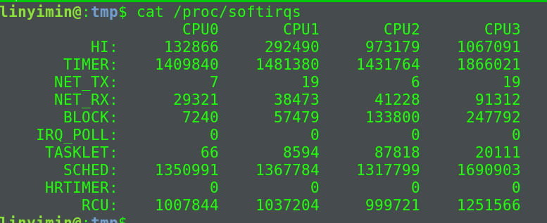
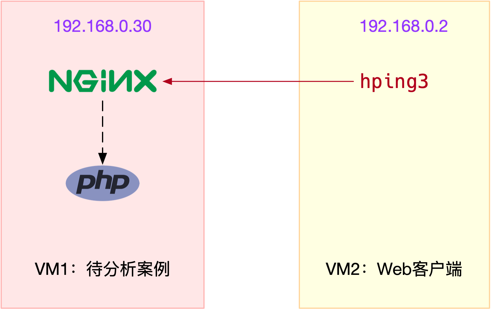
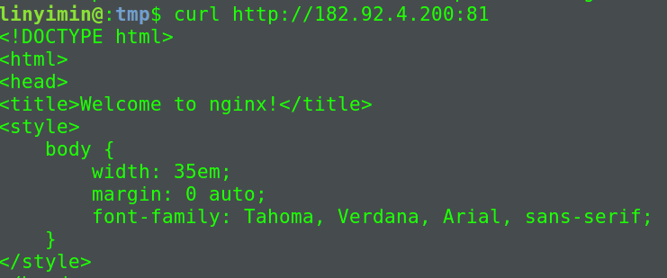
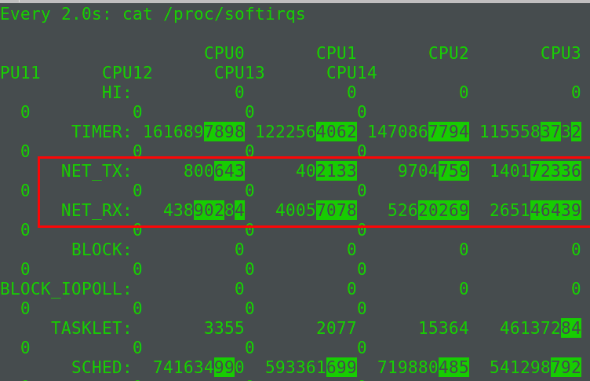

> 管他什么真理无穷,进一寸有一寸的欢喜

## 理解软中断

前面[不可中断进程和僵尸进程](http://blog.linyimin.club/blog/uninrruptible-process-and-zombie.html)我们说过进程的不可中断状态是系统的一种保护机制，<font color="#dd000">是系统响应硬件设备请求的一种机制，会打断进程的正常调度和执行，调用内核中的中断处理程序来响应设备的请求</font>，这个交互过程不被意外（中断或者其他进程）打断，所以短时间的不可中断状态是正常的。但是进程长时间处于不可中断状态可能是IO出现了问题。

根据[CPU使用率过高分析及优化](http://blog.linyimin.club/blog/CPU-100-analysis.html)我们可以知道除了iowait，`irq`硬中断和`softirq`软中断使CPU使用率升高也是最常见的一种性能问题。

<font color="#dd0000">中断是一种异步的事件处理机制，可以提高系统的并发处理能力。</font>中断处理程序会打断其他进程的运行，所以为了减少对正常进程运行调度的影响，中断处理程序需要尽可能快的执行。如果中断处理程序运行的时间过长可能会引起**中断丢失的问题**。


为了解决中断处理程序运行时间过长和中断丢失的问题，Linux将中断处理过程分为两个阶段：

- 上部分： 快速处理中断，在**中断禁止模式**下运行，主要处理与硬件相关和时间敏感的工作（直接处理硬件请求，硬中断，快速执行）
- 下部分： 用来延迟处理上部分未完成的工作，通常以内核进程的方式运行。（由内核触发，软中断，延迟执行）

相关例子： **网卡接收数据包**

网卡接收到数据之后，会通过硬件中断的方式通知内核，内核调用中断处理程序进行相关的处理：

- 上部分： 将网卡数据拷贝到内存，并更新相关寄存器状态（表示数据已经读取完毕），最后发送一个软中断信号
- 下部分： 由软中断信号唤醒，读取内存数据，按照网络协议栈对数据进行逐层解析和处理，最后交付给应用进程。

对于多核CPU来说，每个CPU都对应着一个软中断内核进程（ksoftirqd/CPU编号），同时软中断还包含了内核自定义的一些事件，例如内核调度和RCU锁等。

## 查看软中断和内核线程

- 软中断的运行情况

```shell
$ cat /proc/softirqs
```



- 应中断的运行情况

```shell
$ cat /proc/interrupts
```


- 内核线程

```shell
$ ps -aux | grep ksoftirqd
```


## 案例分析

使用两台虚机，其中虚机1运行Nginx服务器，虚机2用作客户端，用来给Nginx施加压力（SYN FLOOD攻击）。




### 使用的工具

- sar： 收集、查看及保存系统活动信息的工具
- hping3： 构造TCP/IP协议数据包的工具
- tcpdump： 常用的网络抓包工具


### 启动应用

**虚机1：**

启动Nginx服务

```shell
# 运行nginx服务器，并对外开放81端口
$ sudo docker run -itd --name=nginx -p 81:80 nginx
```

**虚机2：**

1. 测试Nginx服务

```shell
$ curl http://182.92.4.200:81
```



2. 使用`hping3`命令模拟Nginx的客户端请求

```shell
# -S 设置tcp协议的SYN标志
# -p 设置目标端口
# -i u100 每个100微秒发送一个网络帧
 
$ hping3 -S -p 81 u100 182.92.4.200
```


这时候转到虚机1的终端，会发现系统响应明显变慢。下面我们具体来分析：

1. 使用`top`命令查看系统的资源使用情况


可以发现：

- 平均负载全变为0
- 每个CPU使用率都很低
- 占用CPU最多的是软中断进程

所以，系统响应变慢可能是软中断引起的。所以我们需要查看软中断的变化的情况：

```shell
$ watch -d cat /proc/softirqs
```



可以发现，网络数据包接收的软中断变化速率最快。所以我们从网络数据包接收的软中断入手，首先观察网络数据包的接收情况：

```shell
# -n DEV 表示显示网络收发的报告
$ sar -n DEV 1
```


根据结果，我们可以知道：

- 网卡eth1每秒收到的网络帧数最大为13279，千字节数为518.77，而发送网络帧数比较少为8250，千字节数为480.06，接收的数据帧平均大小为：518.77 × 1024 / 13279 = 40字节。显然这是一个非常小的数据帧，也就是我们经常所说的小包问题。

接下来我们需要确认接收的数据帧类型以及从是哪里发过来的。要确定一个网络数据包的类型，我们需要使用`tcpdump`进行抓包分析。

```shell
# -i eth1 只抓取eth1网卡
# -n 不解析协议名和主机名
$ tcpdump -i eth1 -n tcp
```


可以发现虚机1收到来自`106.120.206.146:55134`客户端的请求连接数据包（Flags[S]表示该包是一个SYN包）

结合之前`sar`命令的结果，我们可以判断这是一个`SYN FLOOD`攻击。

解决`SYN FLOOD`攻击最简单的方法是：<font color="#dd0000">在交换机或者防火墙中封掉来源IP</font>

需要注意的是：之前的系统响应变慢是指<font color="#dd0000">由于大量的软中断引起的网络延迟增大，我们通过ssh连接虚机，所以会觉得系统响应变慢，实际上是网络传输引起的，而并非虚机系统本身响应变慢</font>