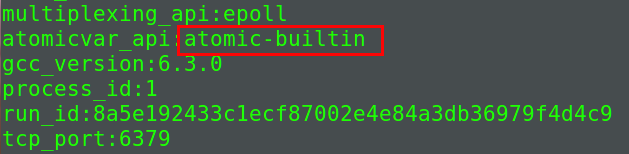
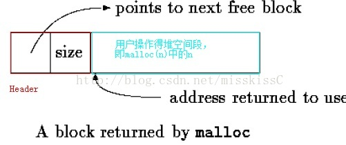

> 破山中贼易,破心中贼难

C语言中没有自带GC, 所有的内存的分配和释都由开发者自己控制.为了实现内存分配释放的合理性和高效性, Redis封装了C语言中的`malloc`, `calloc`和`realloc`和`free`函数来实现对内存的管理.这些实现包含在`zmalloc.c`和`zmalloc.h`文件中.

Redis封装后的内存管理, 主要具有以下特点:

1. 记录已使用内存大小
2. 内存管理  

## 记录已使用内存大小

通过维护`use_memory`变量, 表示已使用内存大小, 每当新分配或释放内存时都会对其进行更新.更新操作提供线程安全和非线程安全两种方式.


### 线程安全

在文件`zmalloc.c`中我们可以看到这部分的源码

```c
// 使用c11规范的内置函数
#if defined(__ATOMIC_RELAXED)
#define update_zmalloc_stat_add(__n) __atomic_add_fetch(&used_memory, (__n), __ATOMIC_RELAXED)
#define update_zmalloc_stat_sub(__n) __atomic_sub_fetch(&used_memory, (__n), __ATOMIC_RELAXED)
// 使用GCC提供的内置函数
#elif defined(HAVE_ATOMIC)
#define update_zmalloc_stat_add(__n) __sync_add_and_fetch(&used_memory, (__n))
#define update_zmalloc_stat_sub(__n) __sync_sub_and_fetch(&used_memory, (__n))
#else

// 使用互斥量
#define update_zmalloc_stat_add(__n) do { \
    pthread_mutex_lock(&used_memory_mutex); \
    used_memory += (__n); \
    pthread_mutex_unlock(&used_memory_mutex); \
} while(0)

#define update_zmalloc_stat_sub(__n) do { \
    pthread_mutex_lock(&used_memory_mutex); \
    used_memory -= (__n); \
    pthread_mutex_unlock(&used_memory_mutex); \
} while(0)

#endif
// 保存内存使用量
static size_t used_memory = 0;
// 指定对used_memory的操是否是线程安全, 默认为非线程安全
static int zmalloc_thread_safe = 0;
// 互斥量
pthread_mutex_t used_memory_mutex = PTHREAD_MUTEX_INITIALIZER;
```

Redis中对`used_memory`变量的操作默认是非线程安全的. 我们可以通过调用`zmalloc_enable_thread_safeness`函数, 指定为线程安全操作.

- 使用`c11`规范中的内置函数`__atomic_add_fetch`和`__atomic_sub_fetch`

- 使用`GCC`提供的内置函数`__sync_add_and_fetch`和`__sync_add_and_fetch`

- 使用互斥量`pthread_mutex_t`



目前新版的Redis中使用的是`GCC`提供的内置函数实现对某一个变量的原子操作.

### 内存对齐

由于存在`内存对齐`, 实际申请得到的内存(`sizeof(long)`的整数倍)可能要大于指定的字节数, 所以在统计内存的时候, 应该考虑实际申请的内存大小.所以如果申请的内存不是`sizeof(long)`的倍数, 需要向上取整为`sizeof(long)`的倍数.

在`zmalloc.c`文件中向上取整的算法如下:

```C
#define update_zmalloc_stat_alloc(__n) do { \
    size_t _n = (__n); \
    if (_n&(sizeof(long)-1)) _n += sizeof(long)-(_n&(sizeof(long)-1)); \
    if (zmalloc_thread_safe) { \
        update_zmalloc_stat_add(_n); \
    } else { \
        used_memory += _n; \
    } \
} while(0)

#define update_zmalloc_stat_free(__n) do { \
    size_t _n = (__n); \
    if (_n&(sizeof(long)-1)) _n += sizeof(long)-(_n&(sizeof(long)-1)); \
    if (zmalloc_thread_safe) { \
        update_zmalloc_stat_sub(_n); \
    } else { \
        used_memory -= _n; \
    } \
} while(0)
```

核心代码是: 

```C
if (_n&(sizeof(long)-1)) {
  _n += sizeof(long)-(_n&(sizeof(long)-1));    
} 
```


`_n`表示申请的内存大小.意思是将申请的内存字节数目对于sizeof(long)来向上取整,即总是取sizeof(long)的倍数.

这个算法可能有点难以理解, 我们可以从原始最简单的算法开始推算: `当需要对齐的时候, 我们需要把多余的部分删除, 然后再加上一个sizeof(long)即可`:

```C
// 如果不是sizeof(long)的倍数
if (n % sizeof(long)) {
  n = n - (n % sizeof(long)) + sizeof(long);
}
```

因为sizeof(long)是2的幂, 所以取余操作可以使用与运算替代: `n % sizeof(long)`与`n & (sizeof(long) - 1)`是等价的.所以上述算法可以转换成:

```C
if (n & sizeof(long) - 1) {
  n = n - (n & sizeof(long) - 1) + sizeof(long);
}
``` 

## 内存管理

### 内存申请

内存申请函数在内置内存申请函数的功能的基础上, 添加了以下功能:

1. 申请失败时错误处理
2. 记录内存申请大小

#### 申请失败时错误处理

```C
static void zmalloc_default_oom(size_t size) {
    fprintf(stderr, "zmalloc: Out of memory trying to allocate %zu bytes\n",
        size);
    fflush(stderr);
    abort();
}

static void (*zmalloc_oom_handler)(size_t) = zmalloc_default_oom;
```

可以发现, 错误处理比较简单: 当申请内存失败时, 向错误输出打印内存不足提示,然后直接挂起程序.


#### 记录内存申请大小

```C
void *zmalloc(size_t size) {
    // 多分配PREFIX_SIZE字节的内存
    void *ptr = malloc(size+PREFIX_SIZE);

    if (!ptr) zmalloc_oom_handler(size);
#ifdef HAVE_MALLOC_SIZE
    update_zmalloc_stat_alloc(zmalloc_size(ptr));
    return ptr;
#else
    // 多分配的内存保存实际分配的内存
    *((size_t*)ptr) = size;
    update_zmalloc_stat_alloc(size+PREFIX_SIZE);
    return (char*)ptr+PREFIX_SIZE;
#endif
}
``` 

可以发现在分配内存的时候, 会多分配 `PREFIX_SIZE` 字节的内存空间并且存储此次分配内存空间的大小, 但是最终返回的是右偏移了`PREFIX_SIZE`字节的指针, 也就是实际内存开始的位置.

由于使用标准库中的`malloc`函数分配内存时, 实际内存和传入的参数不一致, 需要从header中获取实际内存的大小.



```C
size_t zmalloc_size(void *ptr) {
    void *realptr = (char*)ptr-PREFIX_SIZE;
    size_t size = *((size_t*)realptr);
    /* Assume at least that all the allocations are padded at sizeof(long) by
     * the underlying allocator. */
    if (size&(sizeof(long)-1)) size += sizeof(long)-(size&(sizeof(long)-1));
    return size+PREFIX_SIZE;
}
```

`header`是一个`size_t`类型数据, 所以`size = *((size_t *) (char *)ptr - PREFIX_SIZE)`, 同时需要进行内存对齐.

### 释放内存

```C
void zfree(void *ptr) {
#ifndef HAVE_MALLOC_SIZE
    void *realptr;
    size_t oldsize;
#endif

    if (ptr == NULL) return;
#ifdef HAVE_MALLOC_SIZE
    update_zmalloc_stat_free(zmalloc_size(ptr));
    free(ptr);
#else
    realptr = (char*)ptr-PREFIX_SIZE;
    oldsize = *((size_t*)realptr);
    update_zmalloc_stat_free(oldsize+PREFIX_SIZE);
    free(realptr);
#endif
}
```

由于申请的内存中记录了内存的大小, 所以只需要从中读出内存的大小, 然后更新`used_memory`, 最后调用`free`函数释放即可.

## 参考链接

[Redis分配内存的一些疑惑](https://zhuanlan.zhihu.com/p/27120107)
[redis源码阅读之内存管理](http://github.tiankonguse.com/blog/2016/04/03/redis-allocated-memory.html)
