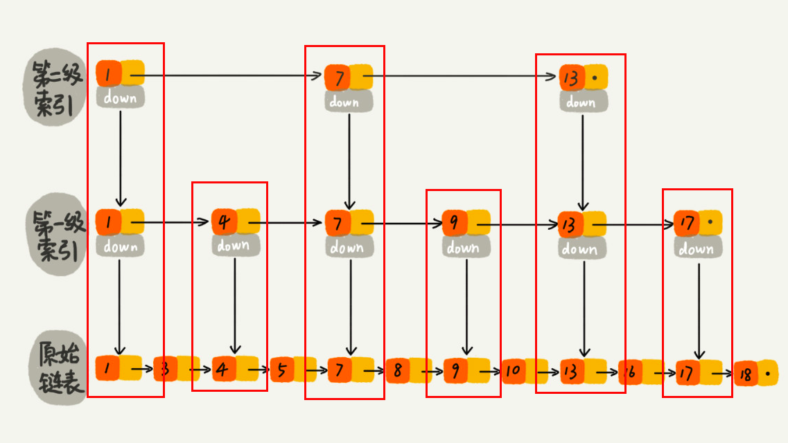
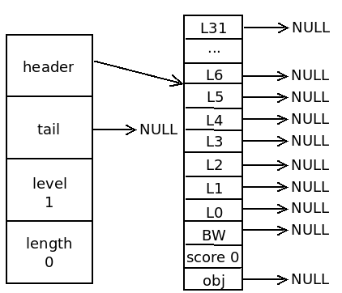
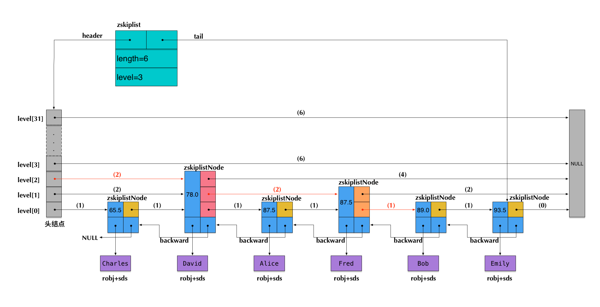

跳表可以理解成可以二分查找的链表.为了快速查找有序链表中的指定节点, 我们可以通过添加多层索引结构实现节点的快速查找.


跳表支持平均O(logN), 最坏O(N)复杂度的节点查找, 同时还可以通过使用顺序性批量处理节点.

## 跳表的数据结构

### 跳表节点结构

```c
typedef struct zskiplistNode {
    robj *obj;                        // 成员对象
    double score;                     // 分值, 用于排序
    struct zskiplistNode *backward;   // 后退指针, 相当于prev指针, 主要用于链表的逆向遍历
    // 链表的索引层
    struct zskiplistLevel {
        struct zskiplistNode *forward;  // 下一个节点, 相当于next指针
        unsigned int span;              // 跨度, 记录两个索引节点之间的距离
    } level[];
} zskiplistNode;
```

level[]: 具有相同成员变量索引节点构成的数组.




### 跳表结构定义

```c
typedef struct zskiplist {
    struct zskiplistNode *header, *tail;
    unsigned long length;
    int level;
} zskiplist;
```

仅靠多个跳表节点就能组成一个跳表, 但是为了更方便操作跳表 -- 快速访问跳表的头结点和尾节点, 或者快速获取跳表节点的数量信息, 所以Redis中定义了跳表的数据结构`zskiplist`.


## 常用跳表操作

### `zslCreate`: 创建一个新的跳表

```c
zskiplist *zslCreate(void) {
    int j;
    zskiplist *zsl;
    // 分配内存空间
    zsl = zmalloc(sizeof(*zsl));
    zsl->level = 1;
    zsl->length = 0;
    // 初始化头节点
    zsl->header = zslCreateNode(ZSKIPLIST_MAXLEVEL,0,NULL);
    for (j = 0; j < ZSKIPLIST_MAXLEVEL; j++) {
        zsl->header->level[j].forward = NULL;
        zsl->header->level[j].span = 0;
    }
    zsl->header->backward = NULL;
    zsl->tail = NULL;
    return zsl;
}
```

最大层为32层, 初始化时, level数组中的每个节点都指向null, 表示跳表为空.




### `zslFree`: 释放跳表

```c
void zslFree(zskiplist *zsl) {
    zskiplistNode *node = zsl->header->level[0].forward, *next;

    zfree(zsl->header);
    while(node) {
        next = node->level[0].forward;
        zslFreeNode(node);
        node = next;
    }
    zfree(zsl);
}
```




根据示意图, 可以发现: 跳跃表的释放和链表的释放一样, 需要遍历整个链表, 一个节点一个节点的释放, 但是释放之前需要保存下一个节点, 最后再释放整个链表.


### `zslInsert`: 添加新节点到跳表中

```c
zskiplistNode *zslInsert(zskiplist *zsl, double score, robj *obj) {
    // 保存要插入节点位置的前驱节点
    zskiplistNode *update[ZSKIPLIST_MAXLEVEL], *x;
    // 保存要插入节点位置前驱节点的排位
    unsigned int rank[ZSKIPLIST_MAXLEVEL];
    int i, level;
    redisAssert(!isnan(score));
    x = zsl->header;
    // 遍历跳表, 找出插入节点的前驱节点, 同时计算并保存前驱节点的排位
    for (i = zsl->level-1; i >= 0; i--) {
        rank[i] = i == (zsl->level-1) ? 0 : rank[i+1];
        while (x->level[i].forward &&
            (x->level[i].forward->score < score ||
                (x->level[i].forward->score == score &&
                compareStringObjects(x->level[i].forward->obj,obj) < 0))) {
            rank[i] += x->level[i].span;
            x = x->level[i].forward;
        }
        update[i] = x;
    }
    // 随机生成新插入节点的层数
    level = zslRandomLevel();
    // 如果层数大于跳表中其他节点的层数
    // 那么初始化表头节点中未使用的层，并将它们记录到 update 数组中
    if (level > zsl->level) {
        for (i = zsl->level; i < level; i++) {
            rank[i] = 0;
            update[i] = zsl->header;
            update[i]->level[i].span = zsl->length;
        }
        zsl->level = level;
    }
    // 创建新节点
    x = zslCreateNode(level,score,obj);
    for (i = 0; i < level; i++) {
        // 将新节点插入跳表
        x->level[i].forward = update[i]->level[i].forward;
        update[i]->level[i].forward = x;
        
        // 更新前驱节点和新插入节点的跨度
        x->level[i].span = update[i]->level[i].span - (rank[0] - rank[i]);
        update[i]->level[i].span = (rank[0] - rank[i]) + 1;
    }
    
    // 当新插入节点的层数比其他节点的层小
    // 由于插入了新节点, 这些节点的跨度也需要更新
    for (i = level; i < zsl->level; i++) {
        update[i]->level[i].span++;
    }
    
    // 更新后退指针
    
    // 在跳表头部插入新数据
    x->backward = (update[0] == zsl->header) ? NULL : update[0];
    
    if (x->level[0].forward)
        x->level[0].forward->backward = x;
    else
        // 在跳表尾部插入新节点
        zsl->tail = x;
    zsl->length++;
    return x;
}
```

1. 找出插入节点的前驱节点, 并记录前驱节点的排位
2. 随机确定新节点的层数
3. 如果层数大于跳表的层数, 需要初始化表头节点未使用的层
4. 创建新节点, 并把新节点插入跳表中, 并更新节点的跨度
5. 设置新节点的尾指针

### `zslDeetel`: 删除跳表中的节点

```c
int zslDelete(zskiplist *zsl, double score, robj *obj) {
    zskiplistNode *update[ZSKIPLIST_MAXLEVEL], *x;
    int i;
    x = zsl->header;
    for (i = zsl->level-1; i >= 0; i--) {
        while (x->level[i].forward &&
            (x->level[i].forward->score < score ||
                (x->level[i].forward->score == score &&
                compareStringObjects(x->level[i].forward->obj,obj) < 0)))
            x = x->level[i].forward;
        update[i] = x;
    }
    x = x->level[0].forward;
    if (x && score == x->score && equalStringObjects(x->obj,obj)) {
        zslDeleteNode(zsl, x, update);
        zslFreeNode(x);
        return 1;
    }
    return 0;
}

void zslDeleteNode(zskiplist *zsl, zskiplistNode *x, zskiplistNode **update) {
    int i;
    for (i = 0; i < zsl->level; i++) {
        if (update[i]->level[i].forward == x) {
            update[i]->level[i].span += x->level[i].span - 1;
            update[i]->level[i].forward = x->level[i].forward;
        } else {
            update[i]->level[i].span -= 1;
        }
    }
    if (x->level[0].forward) {
        x->level[0].forward->backward = x->backward;
    } else {
        zsl->tail = x->backward;
    }
    while(zsl->level > 1 && zsl->header->level[zsl->level-1].forward == NULL)
        zsl->level--;
    zsl->length--;
}
```

1. 找出要删除节点的前驱节点
2. 使用前驱节点删除目标节点
   1. 如果前驱节点的下一个节点等于删除节点, 删除目标节点, 且前驱节点的跨度设加上删除节点的跨度-1
   2. 否则, 只修改前驱节点的跨度, 跨度直接减1
3. 如果删除的节点是尾节点, 需要将跳表的尾节点设为前驱节点
4. 否则需要将删除节点的后继节点的`backward`节点设为删除节点的前驱节点
5. 需要注意的是, 如果删除的节点是跳表的最大层数, 我们需要更新层数


### `zslGetRank`: 获取跳表中给定成员的排位(起始排位为1)

```c
unsigned long zslGetRank(zskiplist *zsl, double score, robj *o) {
    zskiplistNode *x;
    unsigned long rank = 0;
    int i;
    x = zsl->header;
    for (i = zsl->level-1; i >= 0; i--) {
        while (x->level[i].forward &&
            (x->level[i].forward->score < score ||
                (x->level[i].forward->score == score &&
                compareStringObjects(x->level[i].forward->obj,o) <= 0))) {
            rank += x->level[i].span;
            x = x->level[i].forward;
        }
        if (x->obj && equalStringObjects(x->obj,o)) {
            return rank;
        }
    }
    return 0;
}
```

从最高层开始遍历节点, 由于每个节点都包含`span`变量, 所以很容易完成节点数的统计, 若节点对象小于目标对象, 则`rank += curNode.span`, 最后每层遍历结束时, 判断对象是否相等, 若相等, 直接返回`rank`, 否则遍历下一层. 如果遍历完成, 也没有找到目标节点, 说明目标节点不存在, 直接返0. 

### `zslGetElementByRank`: 获取跳表中给定排位的节点

```c
zskiplistNode* zslGetElementByRank(zskiplist *zsl, unsigned long rank) {
    zskiplistNode *x;
    unsigned long traversed = 0;
    int i;
    x = zsl->header;
    for (i = zsl->level-1; i >= 0; i--) {
        while (x->level[i].forward && (traversed + x->level[i].span) <= rank)
        {
            traversed += x->level[i].span;
            x = x->level[i].forward;
        }
        if (traversed == rank) {
            return x;
        }
    }
    return NULL;
}
```

很容易理解, 从最高层开始遍历, 从最高层开始遍历节点, 由于每个节点都包含`span`变量, 所以很容易完成节点数的统计, 同时比较当前节点的排位和目标排位, 若小于目标排位, 则继续遍历, 直至相等, 然后返回目标节点.

若不存在目标排位, 直接返回null.


### `zslInRange`: 给定一个分值范围, 如果跳表至少存在一个节点的分值在这个范围则返回1, 否则返回0

```c
int zslIsInRange(zskiplist *zsl, zrangespec *range) {
    zskiplistNode *x;

    // 如果分值范围为空, 直接返回0 
    if (range->min > range->max ||
            (range->min == range->max && (range->minex || range->maxex)))
        return 0;
    x = zsl->tail;
    // 如果跳表的最大值小于分值范围的下界, 说明不存在节点的分支处于此范围
    if (x == NULL || !zslValueGteMin(x->score,range))
        return 0;
    x = zsl->header->level[0].forward;
    // 如果跳表的最最小值大于分值范围的上界, 说明不存在节点的分支处于此范围
    if (x == NULL || !zslValueLteMax(x->score,range))
        return 0;
    // 否则存在节点的分支处于此范围内
    return 1;
}
```


## 参考链接

[Redis 数据结构 skiplist](http://wiki.jikexueyuan.com/project/redis/skiplist.html)