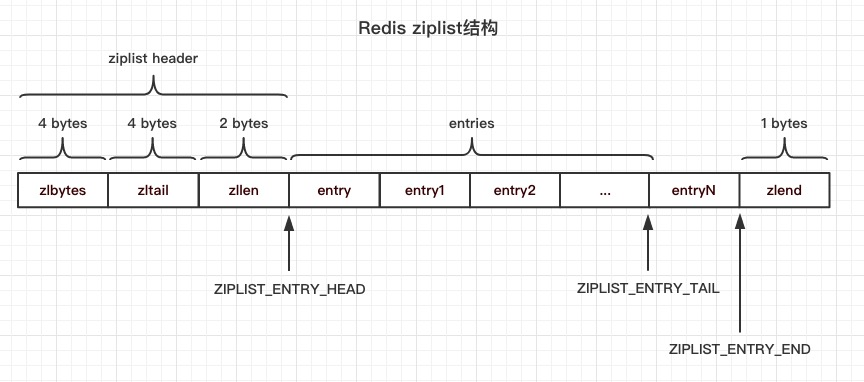

在 Redis 中,list有两种存储方式: 双链表（LinkedList）和压缩双链表（ziplist).压缩列表(ziplist)是列表和哈希的底层实现.当一个列表键只包含少量列表项, 并且每个列表项是小整数值或这长度较短的字符串, Redis会使用压缩列表作为列表对象的底层实现.

压缩链表是Redis为了节约内存而开发的, 由一系列特殊编码的连续内存块组成的顺序性数据结构. 也就是说压缩双链表以连续的内存空间来表示双链表，压缩双链表节省前驱和后驱指针的内存空间(各8 Bytes).

在`ziplist.c`文件的注释中, 给出了`ziplist`的结构: `<zlbytes><zltail><zllen><entry>...<entry><zlend>`

`zlbytes`: 无符号整数`unsigned int`, 表示压缩链表所占用的字节数.

`zltail`: 无符号整数`unsigned int`, 链表中最后一个节点的偏移量, 可以以O(1)复杂度获取链表的尾节点

`zllen`: 无符号整数`unsigned short int`, 链表中节点的个数, 当节点个数大于`2**16 - 2`时, 此变量失效, 需要遍历链表才能获取链表中节点的真实个数

`entry`: 链表节点

`zlend`: 特殊值`255`的一个字节, 标识链表结束. 

同样，在ziplist.c中，我们还可以发现下面几个宏，在注释中我们知道ziplist的结构细节：

```c
// 获取ziplist占用的总字节数，ziplist在zip header的第0~3个字节保存了ZIP_BYTES
#define ZIPLIST_BYTES(zl)       (*((uint32_t*)(zl)))
// 获取ziplist的尾节点偏移量，ziplist在zip header的第4~7个字节保存了ZIP_TAIL
#define ZIPLIST_TAIL_OFFSET(zl) (*((uint32_t*)((zl)+sizeof(uint32_t))))
// 获取ziplist的节点数量，ziplist在zip header的第8~9个字节保存了ZIP_LENGTH
#define ZIPLIST_LENGTH(zl)      (*((uint16_t*)((zl)+sizeof(uint32_t)*2)))
// 获取ziplist的header大小，zip header中保存了ZIP_BYTES(uint32_t)、ZIP_TAIL(uint32_t)和ZIP_LENGTH(uint16_t)，一共10字节
#define ZIPLIST_HEADER_SIZE     (sizeof(uint32_t)*2+sizeof(uint16_t))
// 获取ziplist的ZIP_END大小，是一个uint8_t类型，1字节
#define ZIPLIST_END_SIZE        (sizeof(uint8_t))
// 获取ziplist ZIP_ENTRY头节点地址，ZIP_ENTRY头指针 = ziplist首地址 + head大小
#define ZIPLIST_ENTRY_HEAD(zl)  ((zl)+ZIPLIST_HEADER_SIZE)
// 获取ziplist ZIP_ENTRY尾节点地址，ZIP_ENTRY尾指针 = ziplist首地址 + 尾节点偏移量
#define ZIPLIST_ENTRY_TAIL(zl)  ((zl)+intrev32ifbe(ZIPLIST_TAIL_OFFSET(zl)))
// 获取ziplist尾指针（ZIP_END），ziplist尾指针 = ziplist首地址 + ziplist占用的总字节数 - 1
#define ZIPLIST_ENTRY_END(zl)   ((zl)+intrev32ifbe(ZIPLIST_BYTES(zl))-1)
```

Redis ziplist的数据结构示意图：


