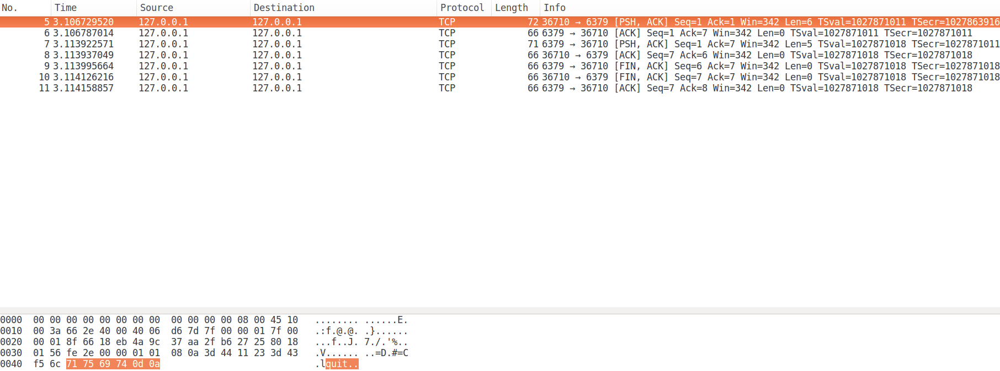
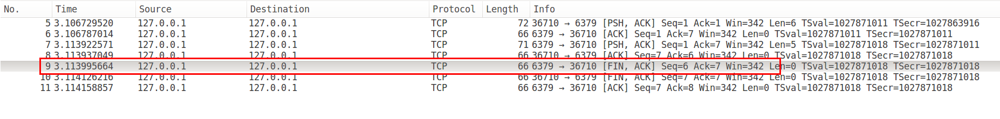

对启动参数和配置文件的处理:

先指定配置文件路径, 在指定参数, 参数(会覆盖配置文件里的相同配置项)最终会和配置文件一起处理

### 以后台的方式运行

```c
void daemonize(void) {
    int fd;

    // fork一个子进程运行, 父进程直接退出
    if (fork() != 0) exit(0);
    // 子进程创建一个新会话运行
    setsid();
    // 使用/dev/null覆盖标准输入, 标准输出, 标准错误输出
    if ((fd = open("/dev/null", O_RDWR, 0)) != -1) {
        dup2(fd, STDIN_FILENO);
        dup2(fd, STDOUT_FILENO);
        dup2(fd, STDERR_FILENO);
        if (fd > STDERR_FILENO) close(fd);
    }
}
```

### 看门狗

指定时间间隔, 发送SIGALRM信号

```c
void watchdogScheduleSignal(int period) {
    struct itimerval it;
    it.it_value.tv_sec = period/1000;
    it.it_value.tv_usec = (period%1000)*1000;
    it.it_interval.tv_sec = 0;
    it.it_interval.tv_usec = 0;
    setitimer(ITIMER_REAL, &it, NULL);
}

```

### 获取RSS中已修改的内存

```c
size_t zmalloc_get_smap_bytes_by_field(char *field) {
    char line[1024];
    size_t bytes = 0;
    FILE *fp = fopen("/proc/self/smaps","r");
    int flen = strlen(field);
    if (!fp) return 0;
    while(fgets(line,sizeof(line),fp) != NULL) {
        if (strncmp(line,field,flen) == 0) {
            char *p = strchr(line,'k');
            if (p) {
                *p = '\0';
                bytes += strtol(line+flen,NULL,10) * 1024;
            }
        }
    }
    fclose(fp);
    return bytes;
}
```


### redis-cli下`quit`命令和Telnet下`quit`命令

#### redis-cli下的`quit`命令


可以发现, redis-cli并没有将`quit`命令发送给服务器端, 而是直接断开了与服务器端的连接.

```c
if (strcasecmp(argv[0],"quit") == 0 || strcasecmp(argv[0],"exit") == 0){
  exit(0);
}
```

根据代码也可以知道, 当客户端输入`quit`或者`exit`命令时, 会直接退出进程, 所以socket连接也会自动断开连接.


#### Telnet下的`quit`命令



可以发现, Telnet作为客户端先向服务器端发送`quit\r\n`, 服务器端通过: `readQueryFromClient`读取相关命令数据 --> `processInputBuffer` --> `processInlineBuffer`解析相关命令 --> `processCommand`执行`quit`命令, 然后将客户端标志设为`REDIS_CLOSE_AFTER_REPLY`, 触发WRITABLE文件事件, 发送`+OK\r\n`, 然后断开与客户端的连接.




```c
// 执行quit命令
if (!strcasecmp(c->argv[0]->ptr,"quit")) { 
  addReply(c,shared.ok);
  c->flags |= REDIS_CLOSE_AFTER_REPLY;
  return REDIS_ERR;
}
if (c->flags & REDIS_CLOSE_AFTER_REPLY) freeClient(c);
```

可以发现, `redis-cli`下的退出比`telnet`的退出效率要更高.

